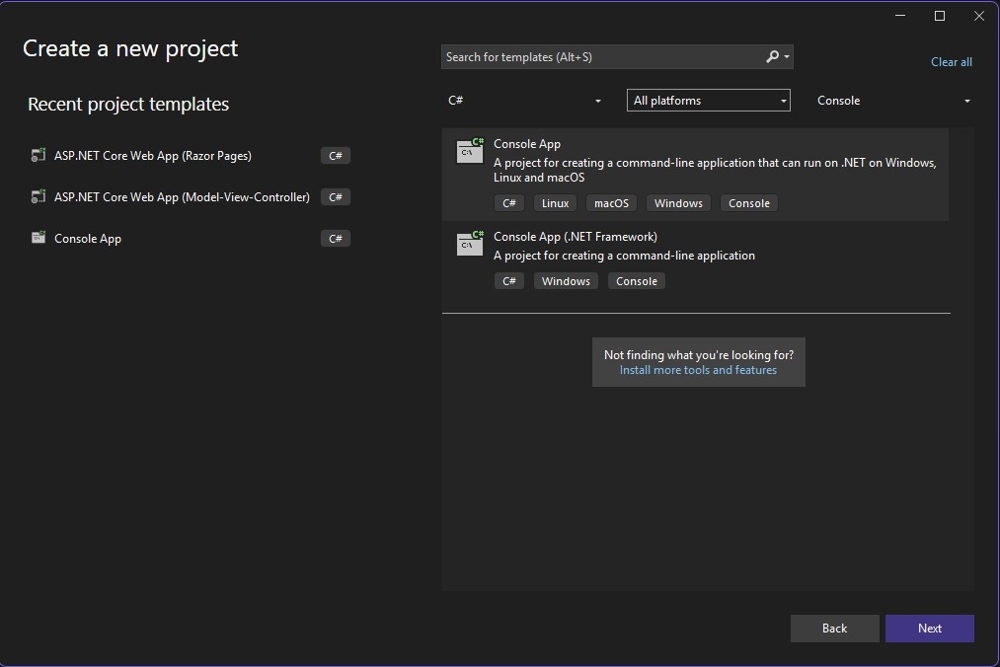
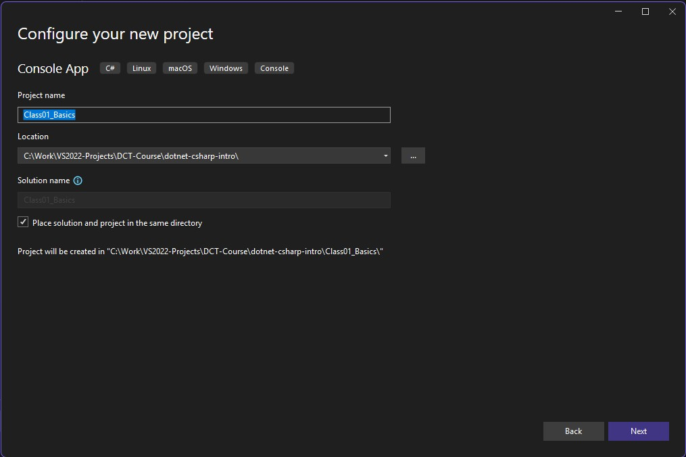
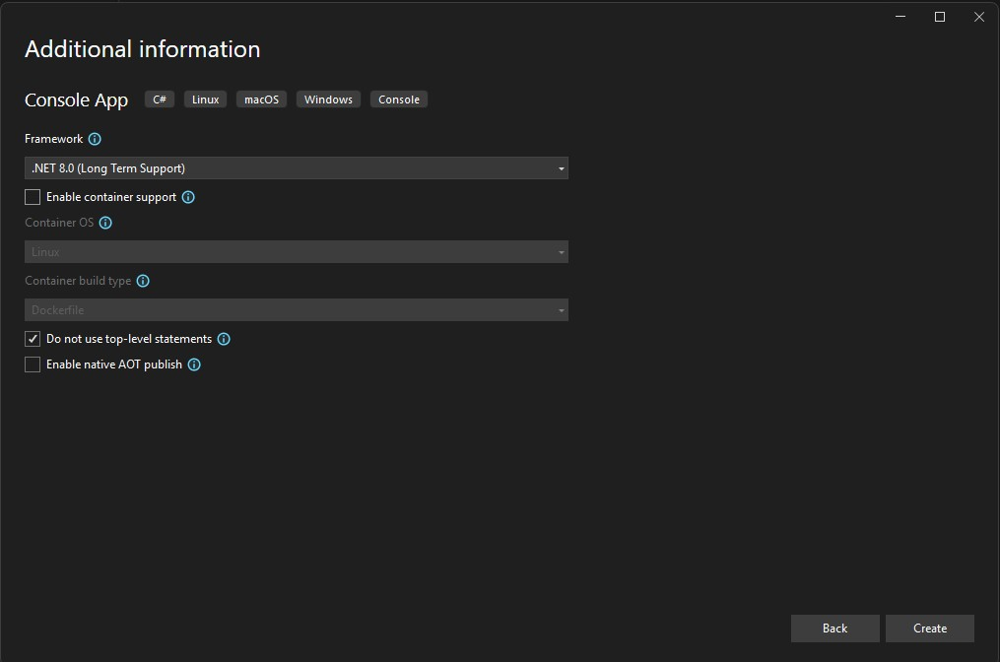

# DotNET C# Introduction
Intro to C# and OOP Using .NET for Beginners

# Folder Structure:
- **dotnet-csharp-intro:**
    - Part01Basics: First steps in C# programming
        - Program.cs => Variables, input/output
        - CastingDemo.cs => Type casting and conversion
        - ControlFlow.cs => Conditional logic: if, else
    - Part02ControlFlowAndCollections: 
        - SwitchDemo.cs => Switch Statement
        - ArrayDemo.cs => 1D and 2D arrays
        - LoopsDemo.cs => For, While, and Do-While loop
        - ListsDemo.cs => List Collection
    - Part03MethodsAndScopes:
        - Program.cs => Methods Full Demonstration
    - Part04ObjectOrientedBasics:
        - Person.cs => Class definition (fields, properties, constructor, method)
        - Program.cs => Main method (creates objects, calls methods)

# Project Initial Steps
Below are the general steps you need to follow in creating a simple C# console app:
1. Select the programming language, platform, and make sure to select 
"Console App" as shown in the image below:
    - 
2. Write the project name and it's more practical to place the solution file within the project folder as shown in the image below:
    - 
3. Select the .NET version 8 as it has a Long Time Support (LTS), also don't use top-level statement as discussed in our lecture and as shown in the image below:
    - 

# Recommended Naming Convention for Visual Studio Project:
PascalCase is the standard naming convention for projects, classes, and namespaces in C#. This means:
- Using PascalCase: Capitalize the first letter of each word without spaces or special characters.
Examples:
 - Part01Basics
 - LoopsAndCollections
 - ControlFlowExamples

- Avoid:
    - Hyphens (-): Not recommended for project or folder names in C#.
    - Underscores (_): Generally avoided in project names.
    - Spaces: Should be replaced with appropriate casing.

Note: While hyphens are common in web URLs and CSS class names (known as kebab-case), they are not standard in C# project names.

## Naming Convention Summary:
- Project Names: Use PascalCase without hyphens or underscores.
- Folder and File Names: Maintain consistency with PascalCase; avoid special characters and spaces.
- Enforce Consistency: Utilize .editorconfig and Visual Studio settings to standardize naming conventions across your project.

By following these conventions, we can ensure that our project structure is clean, consistent, and aligned with C# best practices.

# How to Properly Rename a Project in Visual Studio:
Renaming a C# project in Visual Studio involves more than just changing the project name in Solution Explorer. To ensure your project is clean and consistent, follow these steps:
## Full Step-by-Step Renaming Guide
1. Close Visual Studio
    - Make sure your solution is not open in Visual Studio.
2. Rename the Project Folder
    - In File Explorer, rename the project folder to the new name.
    - Example: Class01_Basics => Part01_Basics.
3. Rename the .csproj File
    - Inside the renamed folder, rename the .csproj file to match the new folder name.
    - Example: Class01_Basics.csproj ➜ Part01_Basics.csproj.
4. Update the .sln File (Optional but Recommended)
    - Open the .sln file in a text editor (e.g., VS Code or Notepad++).
    - Update any references to the old project name (folder and .csproj path).
5. Open the Solution in Visual Studio
    - Double-click the .sln file or open it from Visual Studio.
    - If you renamed things properly, the project should load without errors.
6. Update Namespaces (if needed)
    - If your namespaces include the old project name, use Visual Studio’s Find and Replace feature to update them:
        - Press Ctrl + Shift + H to search and replace across the solution.
        - Example: Replace namespace Class01_Basics ➜ namespace Part01_Basics.
7. Rebuild the Solution
    - Rebuild the project (Ctrl + Shift + B) to confirm that everything is working correctly.

## Quick Shortcut (for small projects)
For a faster rename in simple projects:
- Use Ctrl + Shift + H in Visual Studio to globally replace old names in code files and namespaces.
- If you only changed the .csproj name and folder, Visual Studio might auto-correct references when reopening — but it’s still best to verify all references manually.

# Credits, References, and Resources:
- [My Repository "C# Essentials"](https://github.com/anmarjarjees/csharp-essentials)
- [C# for Beginners – Microsoft Learn](https://learn.microsoft.com/en-us/training/paths/get-started-c-sharp-part-1/)
- [C# Documentation – Microsoft Docs](https://learn.microsoft.com/en-us/dotnet/csharp/)